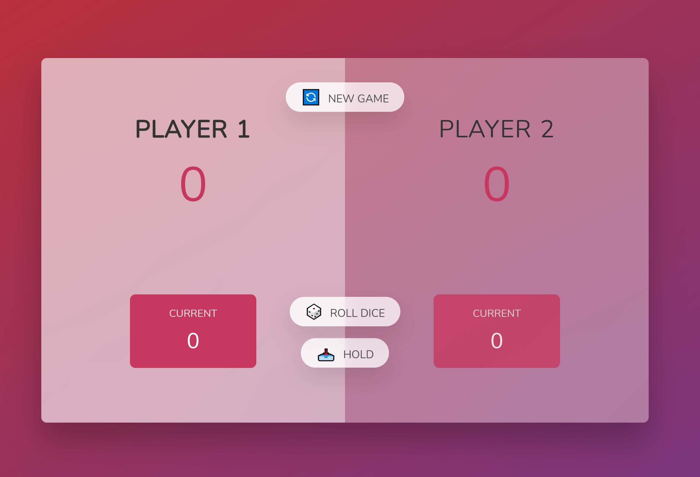
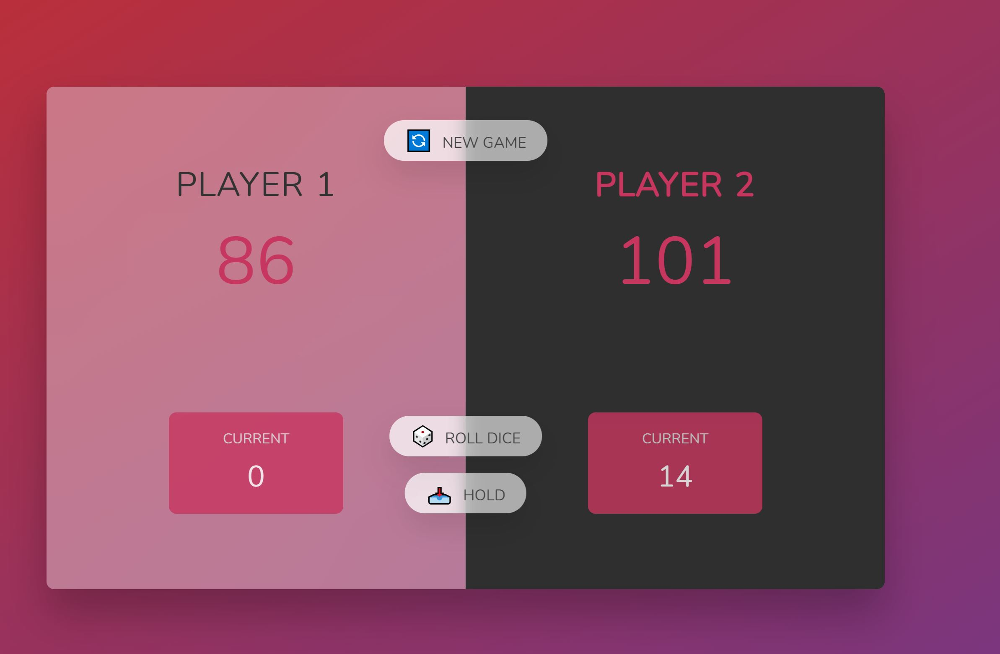

# Pig Game

Practicing JavaScript while taking the course "The Complete JavaScript Course: From Zero to Expert" (https://www.udemy.com/share/101WeY3@k-6lu8fMGfb2XAyn-DbsKXCKeaxDUUdXCv-VVfGaCSZYAVODIN2dvoXc4gYapbMA-Q==/).

## Overview

The code is about a game between 2 players.
The player roll a dice and his score gets added until he rolls a 1 and loses his score.
If the player holds his score before the roll dice 1, the score will be added to his cumulative score, and the role moves to the other player.
When 1 player wins the game, the button are not more functional but the new game button that will reset the game.

## Technologies Used

- DOM manipulation
- If statements
- Functions for:
  - Initial state of the game activated on the new button click
  - Switching the player when rolling 1 or clicking hold

## Links

    - **Solution URL:** https://github.com/J-B-R-93/JavaScript-Pig-Game

    - **Live Site URL:** https://j-b-r-93.github.io/JavaScript-Pig-Game/

## Screenshot

